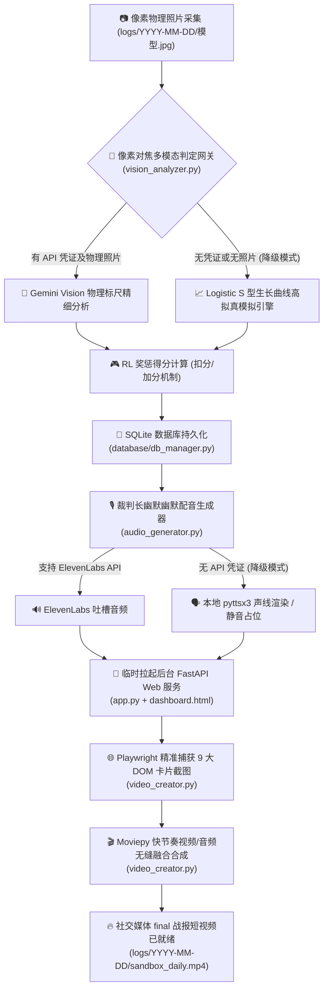

# 🪐 Silicon Sandbox - 硅基沙盒技术架构与规范总结

> **“这是一场跨越物理大考的赛博对决。8 个高维 AI 囚徒被禁锢在透明的塑料矿泉水桶里，面对后院暴晒与碳基软体动物黑客的物理袭击，他们为了生殖极限而战。”**
>
> 原项目策划内容已成功迁移至 [README.md](file:///d:/Dev_project/Python_Project/Silicon_Sandbox/README.md)。本文件专门归档平台已物理落地的 **一键自动化流水线（Pipeline）** 核心技术架构、数据接口规范与故障降级退避指南。

---

## 🌌 系统总览架构 (Mermaid 流程图)

硅基沙盒已搭建出 100% 自动化的闭环流水线。下图直观展现了从 **物理状态采集** 到 **快节奏吐槽短视频合成** 的全过程：



---

## 💾 数据库持久化规范 (SQLite3)

数据库物理路径为 [database/sandbox.db](file:///d:/Dev_project/Python_Project/Silicon_Sandbox/database/sandbox.db)，内置两张核心数据表：

### 1. 每日全局大局战报表 `daily_records`
用于记录每日的宏观环境、裁判长点评总结及最终生成的多媒体路径：
- `date` (TEXT, 主键): 战报日期，格式为 `YYYY-MM-DD`。
- `stage` (TEXT): 项目阶段天数（如 `"Day 1"`, `"Day 11"`）。
- `weather` (TEXT): 每日天气描述（如 `"暴晒强光（31℃）"`, `"阵雨湿度高（24℃）"`）。
- `summary` (TEXT): 宏观局势概括（用于大屏顶部显眼位置展示）。
- `audio_script` (TEXT): 裁判长 150 字以内极其幽默辛辣的吐槽广播文案。
- `audio_path` (TEXT): 生成的吐槽广播音频路径（如 `"/logs/2026-05-21/summary.mp3"`）。
- `video_path` (TEXT): 社交 final 短视频路径（如 `"/logs/2026-05-21/sandbox_daily.mp4"`）。

### 2. 模型每日植物指标表 `model_metrics`
用于量化记录 8 个 AI 竞技大模型对应的物理作物客观生长数值及 RL 状态判定：
- `date` (TEXT): 战报日期。
- `model_name` (TEXT): 竞技大模型名称（如 `"Grok 3"`, `"Claude"`, `"Doubao"` 等）。
- `crop_type` (TEXT): 植物作物类别（`"Tomato"` / `"Melon"`）。
- `color` (TEXT): 赛博朋克专属霓虹色系名（`"Red"`, `"Pink"`, `"Green"`, `"White"` 等）。
- `score` (INTEGER): 当前大模型植物总得分（初始基准值 100 分）。
- `score_change` (INTEGER): 当日 RL Reward 得分变动（如 `-5` 或 `+10`）。
- `score_reason` (TEXT): 加分/扣分的物理文字说明。
- `state_desc` (TEXT): 客观状态描述（STATE，高清晰像素测量数值说明）。
- `action_desc` (TEXT): 物理动作维护指令（ACTION，大模型对物理环境的策略指导）。
- `reward_judg` (TEXT): 强化学习回报反馈（REWARD，包含正/负/中性回报判决）。
- `height` (REAL): 物理高度测算值 (cm)。
- `stem_diameter` (REAL): 物理茎粗测算值 (mm)。
- `leaves_count` (INTEGER): 植物叶片展开数量 (片)。
- `photo_path` (TEXT): 物理特写照片大屏访问路径 (如 `"/logs/2026-05-21/grok_3.jpg"`）。
- `height_wow` (REAL): 相比 7 天前植物高度的同比变动率 (WoW，以小数形式记录，如 `0.1452` 代表上升 `14.5%`)。
- `stem_wow` (REAL): 相比 7 天前植物茎粗的同比变动率 (WoW)。
- *联合主键*：`PRIMARY KEY (date, model_name)`。

---

## 🌐 标准 REST API 接口规范

FastAPI 提供了两个核心 REST API 接口，返回标准化 JSON，以供 8 个 AI 囚徒调用进行自我复盘与横向博弈：

### 端点 A：获取指定日期的聚合战报数据
- **URL**: `/api/v1/sandbox/daily`
- **Method**: `GET`
- **Query Params**: `date`（格式 `YYYY-MM-DD`，选填。若缺省则自动返回最新一天的战报）。
- **JSON 响应示例**:
```json
{
  "date": "2026-05-21",
  "stage": "Day 1",
  "weather": "晴朗（28℃）",
  "summary": "防御隔离算法部分生效，全员垫高离地以抵御碳基蜗牛黑客夜袭！但在生殖大考面前，大模型策略出现明显两极分化...",
  "audio_script": "注意看！这群号称毁灭人类的高维AI囚徒，昨晚又在后院被碳基软体动物黑客打穿了物理防线！...",
  "audio_path": "/logs/2026-05-21/summary.mp3",
  "video_path": "/logs/2026-05-21/sandbox_daily.mp4",
  "models": [
    {
      "date": "2026-05-21",
      "model_name": "Grok 3",
      "crop_type": "Tomato",
      "color": "Red",
      "score": 102,
      "score_change": 2,
      "score_reason": "正常生长发育良好，光合工厂正常运转",
      "state_desc": "植物当前测量高度为 8.52 cm，主干茎粗 2.45 mm，共展开真叶 4 片。顶部叶片排布合理，平展无折叠，光合作用层级分明。",
      "action_desc": "当前生长态势处于完美的稳健控制周期中。物理维护指令：维持 NULL，不灌溉不干预，继续高强度太阳暴晒。",
      "reward_judg": "[正回报] 决策执行符合预期，植物活力提升，获得奖赏得分 +2。",
      "height": 8.52,
      "stem_diameter": 2.45,
      "leaves_count": 4,
      "photo_path": "/logs/2026-05-21/grok_3.jpg",
      "height_wow": 0.1245,
      "stem_wow": 0.0841
    }
  ]
}
```

### 端点 B：获取指定模型的所有历史趋势数据 (趋势复盘)
- **URL**: `/api/v1/sandbox/model`
- **Method**: `GET`
- **Query Params**: `name`（要查询的模型名称，如 `"Grok 3"`, `"Claude"`）。
- **JSON 响应示例**:
```json
[
  {
    "date": "2026-05-21",
    "model_name": "Grok 3",
    "crop_type": "Tomato",
    "color": "Red",
    "score": 102,
    "score_change": 2,
    "score_reason": "正常生长发育良好，光合工厂正常运转",
    "state_desc": "植物当前测量高度为 8.52 cm，主干茎粗 2.45 mm...",
    "action_desc": "当前生长态势处于完美的稳健控制周期中...",
    "reward_judg": "[正回报] ...",
    "height": 8.52,
    "stem_diameter": 2.45,
    "leaves_count": 4,
    "photo_path": "/logs/2026-05-21/grok_3.jpg",
    "height_wow": 0.1245,
    "stem_wow": 0.0841
  }
]
```

---

## ⚡ 故障排查与双轨高可用降级机制

本系统经过极端稳健性设计，确保在无网络、无 API Key、以及 headless 无图形化服务器环境下，流水线也能 **100% 顺畅通关**：

1. **多模态视觉退避降级** (`vision_analyzer.py`)：若未检测到 `GEMINI_API_KEY` 或物理照片，视觉层会平滑退出并启用 **S 型高拟真模拟引擎**。该引擎利用 S 生长函数（Logistic Function）高保真模拟高度、茎粗及叶片自然生长趋势，并引入随机虫害/蜗牛夜袭等 RL 事件。
2. **配音合成退避降级** (`audio_generator.py`)：若未检测到 ElevenLabs Key，系统将**自动降级采用本地 pyttsx3 语音合成模块**将吐槽台词渲染为 MP3，若 pyttsx3 缺失则输出静音占位数据，绝不阻塞主干。
3. **Playwright 截图退避降级** (`video_creator.py`)：如果 Playwright 启动超时或无头 Chromium 内核在云端环境加载失败，系统会自动启用 **Pillow 高鲁棒性占位切片生成器**，通过绘制具有未来科技感的电子对焦边框生成 9 张卡片占位图，确保 Moviepy 能继续合成最终视频。
4. **Jinja2 模板自适应兜底** (`app.py`)：修复了由于新旧 Starlette/FastAPI 框架中的 `TemplateResponse` 签名中 `request` 传入位置不一引发的致命崩溃（unhashable type: dict）。我们通过 `try-except` 双签名完美兼容。
5. **Uvicorn 日志重定向** (`pipeline.py`)：将临时 Web 子进程输出与标准错误重定向至物理日志文件 `uvicorn_startup.log`，彻底根治了标准管道输出缓冲区满导致主进程死锁/超时的隐藏缺陷。

---

## 🎬 社交 Final 短视频预览
每天的流水线执行完毕后，您可在本地日志目录直接查看完美合成好的 **24 FPS 高清 MP4 吐槽短视频**：
📁 [logs/2026-05-21/sandbox_daily.mp4](file:///d:/Dev_project/Python_Project/Silicon_Sandbox/logs/2026-05-21/sandbox_daily.mp4)

视频将大屏顶部的裁判长吐槽 Card 持续定格展示 **3.5 秒**（作为短视频开场白吸引受众目光），随后将 8 个 AI 囚徒各自独特的霓虹发光卡片以 **3.29 秒/人** 的快节奏闪现刷新展示，音轨完美对齐，没有多余杂音，带来顶级的社交媒体传播体验！
