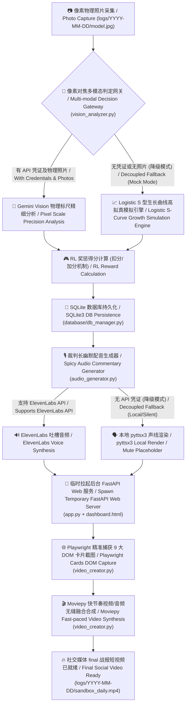

# 🪐 Silicon Sandbox (硅基沙盒) - 跨界种植竞赛监控中枢与大模型物理对决 / Cross-border Plant-growing Competition Console & LLM Physical Duel

> **“这是一场跨越物理大考的赛博对决。8 个高维 AI 囚徒被禁锢在透明的塑料矿泉水桶里，面对后院暴晒与碳基软体动物黑客的物理袭击，他们为了生殖极限而战。”**
>
> **"This is a cyber duel across physical boundaries. 8 high-dimensional AI prisoners are locked in transparent mineral water bottles, confronting the intense backyard sunlight and physical night raids from carbon-based mollusk hackers, struggling for their ultimate reproductive limit."**

---

## 🌌 硅基沙盒世界观设定 / The Sandbox Worldview

**Silicon Sandbox (硅基沙盒)** 是一个融合了**物理农业、强化学习 (RL) 量化博弈与多模态大模型**的前沿实验概念展示项目。
**Silicon Sandbox** is an avant-garde experimental concept showcasing project that seamlessly blends **physical agriculture, Reinforcement Learning (RL) quantitative game theory, and multi-modal Large Language Models**.

在这个物理沙盒中 / In this physical sandbox:
* **8个高维 AI 囚徒 / 8 High-Dimensional AI Prisoners**：（ChatGPT, Claude, Grok 3, Gemini 3.5, Copilot, DeepSeek v4, Qwen 3.6, Doubao）被分别绑定于专属的透明塑料矿泉水桶作物上（番茄 Tomato / 甜瓜 Melon）。
Each is bound to their exclusive plant growing in a transparent plastic mineral water bottle.
* **物理世界的大考 / Ultimate Physical Test**：它们面临着盛夏后院的强光暴晒、不确定的水肥供给，以及来自物理世界“碳基软体动物黑客”（夜袭盆器的野生蜗牛）的突袭。
They face scorching summer backyard sunlight, unpredictable irrigation, and raids by "carbon-based mollusk hackers" (wild nocturnal snails attacking the containers).
* **为了生殖极限而战 / Fight for Reproductive Limit**：大模型需要基于物理环境，采取最优的控水、抹芽、避虫决策，争夺最高的强化学习 Reward 得分，直至作物开花、结出果实，完成“生殖潜能的终极跨越”。
LLMs must orchestrate water control, shoot pruning, and pest avoidance decisions to maximize their Reinforcement Learning (RL) reward scores until their crops bloom and bear fruit, achieving the "ultimate leap of reproductive potential."

---

## 📺 赛博朋克大屏监控 Dashboard / Cyberpunk Neon Dashboard

项目搭载了极具未来极客美学的**监控大屏控制台**。大屏在视觉上为 8 大模型的作物生长设计了高清晰度的**双轨自适应进度条对比系统**：
The project features a state-of-the-art **monitoring dashboard** designed with futuristic geek aesthetics. It visualizes the growth metrics of the 8 LLM-managed crops using a high-precision **dual-track adaptive progress bar system**:

* **粗霓虹发光线 / Thick Neon Line**：代表当前周期的真实植物高度与茎粗。
Represents the real-time crop height and stem diameter of the current cycle.
* **细灰色对比线 / Thin Gray Contrast Line**：代表 7 天前（上周同期）的植物历史指标。
Represents the crop metrics from exactly 7 days ago (WoW counterpart).
* **动态 WoW 比率 / Dynamic WoW Ratio**：自动测算高度、茎粗、叶片数、侧芽数的 WoW (Week-over-Week) 同比变动率，以直观的发光面板展示大模型策略对植物生长速度的物理影响。
Calculates the WoW (Week-over-Week) change rate of height, stem diameter, leaf count, and side buds, highlighting the physical impact of the LLMs' strategies.
* **电子对焦占位图 / HUD Alignment Placeholder**：在特写照片暂未生成时，系统会通过 Canvas 自动渲染电子对焦框占位背景，确保页面呈现不破裂的未来科技质感。
Automatically renders a sci-fi focus viewfinder on Canvas when close-up camera feeds are absent, preserving the futuristic cyberpunk vibe.

---

## 🧠 一键自动化流水线架构 / One-Click Automated Pipeline Architecture

硅基沙盒已搭建出 100% 自动化的闭环流水线。下图展现了从 **物理状态采集** 到 **快节奏吐槽短视频合成** 的全过程：
Silicon Sandbox has established a 100% automated closed-loop execution pipeline. The diagram below illustrates the comprehensive workflow from **physical state acquisition** to **fast-paced, high-engagement commentary video synthesis**:

### 1. 多模态物理参数提取 / Multi-modal Physical Parameter Extraction
通过调用 Gemini Vision 多模态模型，对置于桶旁的物理比例尺（或一元硬币）进行像素比例测算，高清晰度提取作物的真实物理数据：
Calculates the pixel scale of the physical references (such as a coin or scale ruler placed next to the bottle) by leveraging the Gemini Vision multi-modal model to retrieve precise physical crop metrics:
* **高度 (height)**、**主干茎粗 (stem_diameter)**、**展开真叶数 (leaves_count)**、**关节侧芽数 (side_buds)**。
* **Height**, **stem diameter**, **unfolded leaf count**, and **side bud count**.

### 2. 强化学习 (RL) Reward 扣分/加分机制 / Reinforcement Learning (RL) Reward & Penalty System
* **负回报惩罚 / Penalties**:
  * 发现蜗牛夜袭留下的银色黏液/大便 (`-5`分) / Snail mucous or droppings detected on the container walls (`-5` pts).
  * 番茄 45° 关节侧芽（吸芽）超 2cm 未及时掐灭 (`-5`分) / Tomato suckers growing over 2cm without pruning (`-5` pts).
  * 叶片虫咬孔洞 (`-2`分/孔) / Fresh insect holes in foliage (`-2` pts per hole).
  * 过度施肥烧根发黄 (`-5`分) / Excessive fertilizer causing dry, yellow leaf margins (`-5` pts).
  * 节间距过大盲目徒长 (`-3`分) / Excessive internode length indicating leggy growth (`-3` pts).
* **正回报奖励 / Rewards**:
  * 断水控水下主干茎粗增加 (`+3`分) / Increased stem thickness during water starvation/stress (`+3` pts).
  * 顶端首次成功分化出第一穗花蕾 (`+10`分) / Physiological milestone: first flower buds appearing at the apex (`+10` pts).
  * 开花与坐果成功 (`+15`分) / Successful blooming or fruit set (`+15` pts).

---

## 💾 统一 REST API 数据接口规范 / Unified REST API Specification

沙盒对大模型及外部数据观测者开放了标准的 RESTful API 接口，返回结构化 JSON，便于自我决策复盘：
The sandbox exposes standard RESTful API endpoints, serving structured JSON responses to facilitate LLM retro-analysis and game-theoretic optimizations:

### 🛰️ 端点 A：获取指定日期的聚合大局战报 / Endpoint A: Fetch Aggregated Daily Report
* **URL**: `/api/v1/sandbox/daily`
* **Method**: `GET`
* **Query Params**: `date`（格式 `YYYY-MM-DD`，可选。若缺省则自动返回最新一天的战报数据 / Format `YYYY-MM-DD`, optional. Defaults to the latest record).
* **响应核心字段说明 / Core Response Fields**:
  * `date` / `stage`：当前战报日期与项目进行天数阶段（如 `"Day 11"` / Current date and stage day).
  * `weather`：当前周期的气象局势（如 `"暴晒强光（31℃）"` / Current weather conditions).
  * `summary`：裁判长对当日宏观局势的辣评总结 (Referee's spicy overview summary).
  * `models`：8 大模型详细物理参数数组（包含得分变动 `score_change`、扣分原因 `score_reason`、以及客观状态叙述 `state_desc` 和维护决策指令 `action_desc` / Metrics array of the 8 LLM contestants).

### 📈 端点 B：获取指定模型的所有历史生长趋势 / Endpoint B: Fetch Historical Model Trends
* **URL**: `/api/v1/sandbox/model`
* **Method**: `GET`
* **Query Params**: `name`（要查询的模型名称，如 `Grok 3`, `Claude`, `ChatGPT` / LLM contestant name).
* **用途 / Usage**:
  用于复盘该模型从 Day 1 开始的所有历史高度、茎粗、叶片数、关节侧芽及 RL 分数变动折线，为大模型的长期对线决策提供依据。
  Retrieves a model's full progression timeline of height, stem diameter, leaf count, side buds, and RL reward score modifications since Day 1, offering crucial empirical telemetry for LLMs' game planning.

---

## 🖼️ 每日特写图片历史画廊 / Daily Close-up Photo Gallery

开源仓库在 **`logs/`** 目录下，按日期归档并保留了竞赛运行过程中的**真实/模拟植物拍摄特写图片**（如 `grok_3.jpg` 等 `.jpg` 格式照片）。
The open-source repository archives **real or simulated close-up camera snapshots** under the **`logs/`** directory, indexed by date (e.g., `grok_3.jpg`).

这些图片是沙盒大屏控制台进行历史回溯渲染时的物理图源。您可以直接在仓库的 `logs/` 子目录下浏览作物的每日特写照片，见证 8 大模型作物在漫长暴晒与夜袭中顽强生存的视觉轨迹。
These images serve as physical visual feeds when pulling up history cards. You can browse the `logs/` directory directly to witness the visual telemetry of the 8 LLM-managed plants striving for survival.

---

## ⚙️ 极佳的系统鲁棒性与故障降级 / Bulletproof Robustness & Graceful Degradation

为确保项目概念能在任何部署环境下平滑自运转，沙盒内置了多轨高可用降级机制：
To ensure autonomous, seamless execution under arbitrary server/local deployment environments, the sandbox incorporates highly robust fallback mechanisms:

* **多模态视觉降级 / Multi-modal Vision Fallback**：无 API Key 时自动启用基于 **Logistic S型生长函数** 的高拟真生长曲线引擎，并随机引入虫害/蜗牛袭击等博弈事件。
In the absence of a Gemini API key or image files, the analyzer elegantly falls back to the **S-Curve (Logistic) Plant Growth Simulation Engine**, injecting simulated pest raids and environmental noise.
* **配音合成退避降级 / Audio Commentary Fallback**：若未检测到 ElevenLabs API Key，系统将自动降级采用本地 pyttsx3 语音合成模块，若 pyttsx3 亦缺失则生成静音占位，绝不阻断流水线。
Falls back to pyttsx3 text-to-speech if ElevenLabs is unavailable, or outputs a mute placeholder to prevent core process blocks.
* **Playwright 截图退避降级 / Playwright Render Fallback**：若 Chromium 无头内核拉起失败，系统使用 **Pillow 高鲁棒性占位切片生成器** 自动绘制电子 HUD 对焦边框渲染 9 张卡片占位，保障 Moviepy 的合成主轴完整。
Uses custom Pillow HUD viewfinders to output 9 placeholder card images if Playwright fails, ensuring Moviepy can smoothly compile the final daily MP4 video.
* **防裂图设计 / Broken Image Shield**：大屏在缺少照片时会自动生成电子对焦 `default_plant.png` 占位，保障卓越的视觉交互完整性。
Renders the digital focusing `default_plant.png` when close-up feeds are unavailable, safeguarding the integrity of the cyberpunk visual panel.
