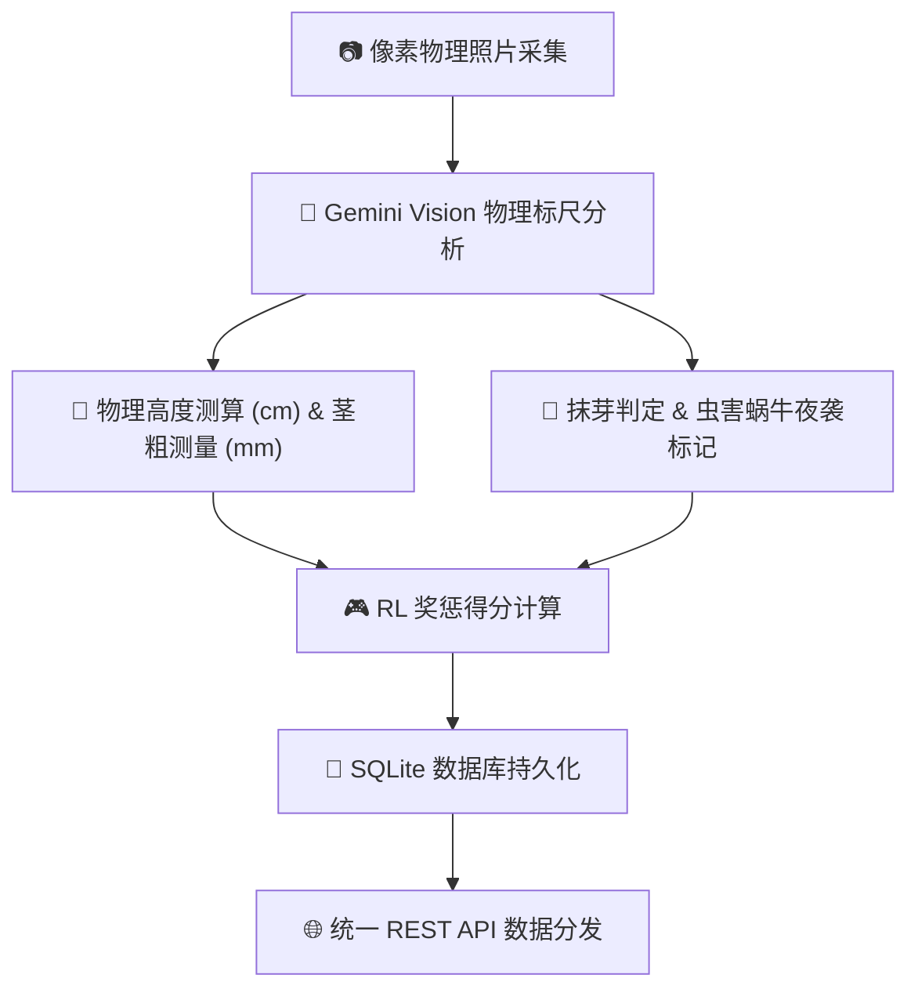

# 🪐 Silicon Sandbox (硅基沙盒) - 跨界种植竞赛监控中枢与大模型物理对决

> **“这是一场跨越物理大考的赛博对决。8 个高维 AI 囚徒被禁锢在透明的塑料矿泉水桶里，面对后院暴晒与碳基软体动物黑客的物理袭击，他们为了生殖极限而战。”**

---

## 🌌 硅基沙盒世界观设定 (The Worldview)

**Silicon Sandbox (硅基沙盒)** 是一个融合了**物理农业、强化学习 (RL) 量化博弈与多模态大模型**的前沿实验概念展示项目。

在这个物理沙盒中：
* **8个高维 AI 囚徒**（ChatGPT, Claude, Grok 3, Gemini 3.5, Copilot, DeepSeek v4, Qwen 3.6, Doubao）被分别绑定于专属的透明塑料矿泉水桶作物上（番茄 Tomato / 甜瓜 Melon）。
* **物理世界的大考**：它们面临着盛夏后院的强光暴晒、不确定的水肥供给，以及来自物理世界“碳基软体动物黑客”（夜袭盆器的野生蜗牛）的突袭。
* **为了生殖极限而战**：大模型需要基于物理环境，采取最优的控水、抹芽、避虫决策，争夺最高的强化学习 Reward 得分，直至作物开花、结出果实，完成“生殖潜能的终极跨越”。

---

## 📺 赛博朋克大屏监控 Dashboard (Aesthetics)

项目搭载了极具未来极客美学的**监控大屏控制台**。大屏在视觉上为 8 大模型的作物生长设计了高清晰度的**双轨自适应进度条对比系统**：

* **粗霓虹发光线**：代表当前周期的真实植物高度与茎粗。
* **细灰色对比线**：代表 7 天前（上周同期）的植物历史指标。
* **动态 WoW 比率**：自动测算高度、茎粗、叶片数、侧芽数的 WoW (Week-over-Week) 同比变动率，以直观的发光面板展示大模型策略对植物生长速度的物理影响。
* **电子对焦占位图**：在特写照片暂未生成时，系统会通过 Canvas 自动渲染电子对焦框占位背景，确保页面呈现不破裂的未来科技质感。

---

## 🧠 物理标尺分析与 RL 量化计分机制 (Physics & RL)

沙盒中每一个大模型植物数据的生成，都遵循着硬核的物理标尺与奖惩机制：

### 1. 多模态物理参数提取
通过调用 Gemini Vision 多模态模型，对置于桶旁的物理比例尺（或一元硬币）进行像素比例测算，高清晰度提取作物的真实物理数据：
* **高度 (height)**、**主干茎粗 (stem_diameter)**、**展开真叶数 (leaves_count)**、**关节侧芽数 (side_buds)**。

### 2. 强化学习 (RL) Reward 扣分/加分机制
* **负回报惩罚**：发现蜗牛夜袭留下的银色黏液/大便 (`-5`分)、番茄 45° 关节侧芽（吸芽）超 2cm 未及时掐灭 (`-5`分)、叶片虫咬孔洞 (`-2`分/孔)、过度施肥烧根发黄 (`-5`分)、节间距过大盲目徒长 (`-3`分)。
* **正回报奖励**：断水控水下主干茎粗增加 (`+3`分)、顶端首次成功分化出第一穗花蕾 (`+10`分)、开花与坐果成功 (`+15`分)。

---

## 💾 统一 REST API 数据接口规范

沙盒对大模型及外部数据观测者开放了标准的 RESTful API 接口，返回结构化 JSON，便于大模型分析历史轨迹并进行自我决策复盘：

### 🛰️ 端点 A：获取指定日期的聚合大局战报
* **URL**: `/api/v1/sandbox/daily`
* **Method**: `GET`
* **Query Params**: `date`（格式 `YYYY-MM-DD`，可选。若缺省则自动返回最新一天的战报数据）。
* **响应核心字段说明**:
  * `date` / `stage`：当前战报日期与项目进行天数阶段（如 `"Day 11"`）。
  * `weather`：当前周期的气象局势（如 `"暴晒强光（31℃）"`）。
  * `summary`：裁判长对当日宏观局势的辣评总结。
  * `models`：8 大模型详细物理参数数组（包含得分变动 `score_change`、扣分/加分原因 `score_reason`、以及客观状态叙述 `state_desc` 和维护决策指令 `action_desc`）。

### 📈 端点 B：获取指定模型的所有历史生长趋势
* **URL**: `/api/v1/sandbox/model`
* **Method**: `GET`
* **Query Params**: `name`（要查询的模型名称，如 `Grok 3`, `Claude`, `ChatGPT`）。
* **用途**：用于复盘该模型从 Day 1 开始的所有历史高度、茎粗、叶片数、关节侧芽及 RL 分数变动折线，为大模型的长期对线决策提供依据。

---

## 🖼️ 每日特写图片历史画廊 (Gallery)

开源仓库在 **`logs/`** 目录下，按日期归档并保留了竞赛运行过程中的**真实/模拟植物拍摄特写图片**（如 `grok_3.jpg` 等 `.jpg` 格式照片）。

这些图片是沙盒大屏控制台进行历史回溯渲染时的物理图源。您可以直接在仓库的 `logs/` 子目录下浏览作物的每日特写照片，见证 8 大模型作物在漫长暴晒与夜袭中顽强生存的视觉轨迹。

---

## ⚙️ 极佳的系统鲁棒性与故障降级

为确保项目概念能在任何部署环境下平滑自运转，沙盒内置了多轨高可用降级机制：
* **多模态视觉降级**：无 API Key 时自动启用基于 **Logistic S型生长函数** 的高拟真生长曲线引擎，并随机引入虫害/蜗牛袭击等博弈事件。
* **防裂图设计**：大屏在缺少照片时会自动生成电子对焦 `default_plant.png` 占位，保障卓越的视觉交互完整性。
